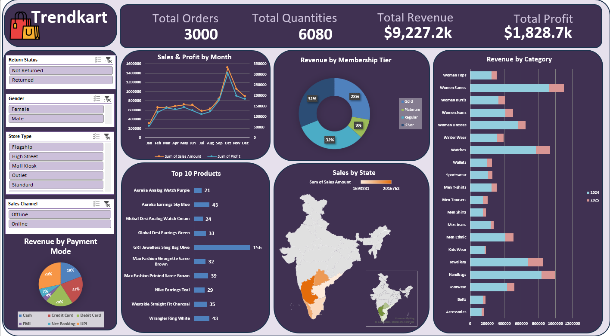

# TrendKart — Fashion Retail Sales Insights Dashboard

## 📌 Project Title
**TrendKart Fashion Enterprise — Data-Driven Sales Insights Dashboard**

## 🎯 Problem Statement
TrendKart's fashion retail data was spread across multiple raw sheets (Sales, Customers, Products, Stores, Employees) and contained data quality issues that made direct analysis unreliable. The goal of this project is to **clean the raw transactional data and build an interactive dashboard to infer meaningful business insights** — identifying sales trends, top-performing products and regions, customer behavior patterns, and payment preferences — to support data-driven decision-making for the business.

## 📂 Dataset / Source Details
- **File:** `TrendMart_Fashion_Enterprise_Dataset.xlsx`
- **Sheets used:**
  | Sheet | Rows | Description |
  |---|---|---|
  | Sales_Transactions | 3,000 | Invoice-level sales records (Apr 2024 – Mar 2025) |
  | Customers | 850 | Customer demographic and membership data |
  | Products | 250 | Product catalog with category, brand, pricing |
  | Stores | 120 | Store details including region/state and monthly targets |
  | Employees | 300 | Employee records |

## 🛠️ Tools & Excel Techniques Used
- **Microsoft Excel** — PivotTables, PivotCharts, Slicers with Report Connections, Power Pivot / Data Model, Filled Map Chart
- **Functions used:** `TRIM()`, `PROPER()`, `SUMPRODUCT()`, `COUNTIF()`, `XLOOKUP()`/`VLOOKUP()`, `IF()` (for Profit/Loss logic)
- **Data cleaning tools:** Go To Special (Blanks/Constants), Paste Special (Values), Find & Replace, Text Filters, Conditional Formatting (Duplicate Values)
- **Dashboard visuals used:** Line chart (dual-axis), Donut charts, Bar charts (stacked by year), Horizontal bar chart, Filled Map (Sales by State), KPI cards, Slicers

## 🧹 Data Cleaning / Analysis Explanation
Before building the dashboard, the raw dataset was audited and cleaned across all sheets:

| Area | Issues Found | Fix Applied |
|---|---|---|
| Invoice No (Sales) | Duplicate values with distinct row data | Flagged for manual review |
| Invoice Date | Mixed date formats | Standardized to `YYYY-MM-DD` |
| Quantity | Numbers stored as text; zero-quantity rows with valid Sales/Cost data | Converted to numeric; missing quantities reverse-calculated from Sales Amount ÷ Unit Price |
| Profit | Miscalculated values | Corrected using `Sales Amount − Cost Amount − GST Amount` |
| Payment Mode / Return Status | Inconsistent casing, extra spaces, typos | Standardized using `TRIM()` + `PROPER()` and manual correction |
| Customer_ID / Product_ID / Employee_ID | Blank values | Cross-referenced where traceable; marked "Unknown" otherwise |
| Gender / Membership (Customers) | Mixed casing | Standardized |
| Email (Customers) | Invalid formats | Identified via validation formula, corrected where possible |
| Brand (Products) | Blanks | Recovered from brand name embedded in Product_Name |

Once cleaned, the data was consolidated into a pivot-ready source and used to build the dashboard shown below.

## 📊 KPIs / Features Explained
| KPI / Feature | Description |
|---|---|
| **Total Orders** | Count of all invoices (3,000) |
| **Total Quantities** | Total units sold across all transactions (6,080) |
| **Total Revenue** | Sum of Sales Amount (₹9,227.2K) |
| **Total Profit** | Sum of Profit after cost & GST (₹1,828.7K) |
| **Sales & Profit by Month** | Dual-axis trend line showing monthly performance across the fiscal year (Apr–Mar) |
| **Revenue by Membership Tier** | Donut chart splitting revenue across Gold/Platinum/Regular/Silver tiers |
| **Revenue by Payment Mode** | Pie chart of revenue share across Cash, Credit Card, Debit Card, EMI, Net Banking, UPI |
| **Top 10 Products** | Ranked bar chart of best-selling products by quantity sold |
| **Sales by State** | Filled map visualizing regional sales concentration across India |
| **Revenue by Category** | Horizontal bar chart comparing category-wise revenue, split by year (2024 vs 2025) |
| **Slicers** | Return Status, Gender, Store Type, Sales Channel — interactively filter every chart on the dashboard simultaneously |

## 📸 Dashboard Screenshot



## 🔍 Key Insights
- **Revenue & Profit:** TrendKart generated **₹9,227.2K in total revenue** and **₹1,828.7K in profit** across 3,000 orders and 6,080 units sold — an overall profit margin of roughly **19.8%**.
- **Seasonal peak:** The Sales & Profit trend line shows a sharp spike around **October**, nearly double most other months — indicating a strong festive/sale-season demand surge, with **January** marking the lowest point of the fiscal year.
- **Membership contribution:** **Regular (32%)** and **Silver (31%)** members together drive **63% of total revenue**, while **Platinum members contribute only 9%**, despite typically being the highest-value tier — suggesting an opportunity to grow this segment.
- **Payment behavior:** **Credit Card (28%)** and **Debit Card (22%)** are the most-used payment modes, together accounting for **50% of revenue**, while **EMI usage is lowest at 4%**.
- **Top product:** *"GRT Jewellers Sling Bag Olive"* is the clear volume leader with **156 units sold**, far ahead of the next-best product — significantly outselling every other item in the Top 10 list.
- **Category performance:** **Women's Sarees, Watches, and Handbags** are the strongest revenue-generating categories, while categories like **Accessories, Belts, and Kids Wear** show comparatively low revenue contribution.
- **Regional concentration:** The Sales by State map shows sales are concentrated in **southern India**, with the deepest color intensity around the **Karnataka/Tamil Nadu region**, indicating TrendKart's core customer base is regionally concentrated rather than pan-India.
- **Year-over-year shift:** Several categories (e.g., Women Sarees, Watches, Handbags, Men Ethnic) show a visible **2025 revenue contribution alongside 2024**, suggesting overall category demand is growing into the new fiscal year.

## ✅ Recommendations / Conclusion
1. **Capitalize on the October peak** — investigate what drove the spike (festival, promotion, pricing) and replicate similar campaigns in other months, especially to lift the low-performing January period.
2. **Grow the Platinum membership segment** — since it contributes disproportionately little revenue (9%) despite being the premium tier, consider targeted loyalty offers to upgrade high-spending Regular/Silver customers.
3. **Double down on top categories** (Sarees, Watches, Handbags) with deeper inventory and marketing focus, while reassessing low-performing categories like Belts and Accessories.
4. **Expand regional reach** — since sales are currently concentrated in South India, explore targeted marketing or store expansion in underrepresented states to diversify revenue geographically.
5. **Promote underused payment modes** (like EMI) through partner offers, which could unlock larger basket sizes for higher-value purchases.
6. Continue maintaining data quality checks at the source (input validation, unique constraints on Invoice No/Phone) to keep future dashboards reliable without repeated manual cleanup.

## 📁 Repository Structure
```
├── Source/
│   ├── Raw/
│   │   └── TrendKart_Fashion_Enterprise_Dataset.xlsx
│   └── Cleaned/
│       └── TrendKart_Fashion_Enterprise_Dataset_Cleaned.xlsx
├── Final_Project/
│   └── TrendMart_Analytics_Project.xlsx    # Final cleaned dataset with dashboard
├── Dashboard/
│   └── Dashboard_Screenshot.png             # Dashboard preview image
└── Documentation/
    ├── Business_Insights.pdf                # Insights & recommendations report
    └── README.md                            # Project documentation (this file)
```

## 🙋 Prepared By
Vasundraa S
